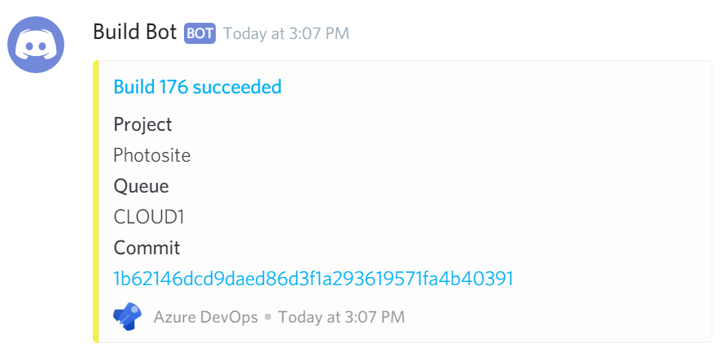

# Build Bot

A Discord bot which announces successful Azure DevOps continous integration builds in chat.

## Installation

Build Bot is deployed using Docker:

    docker run jessehallam/build-bot:latest
    
## Application Configuration

The bot is configured using a yaml file on the file system:

    azure:
      token: aaaaaaaaa
      url: https://dev.azure.com/jessehallam
    bot:
      enable: true
      channel_id: '120000000000000'
      token: NTA0aaaaaaaaa
    webhook:
      auth_token: aaaaaaaaa
      enable: true
      listen_port: 7000
      
`azure.token` An Azure DevOps personal access token. It's used for performing REST calls against the Azure DevOps API.  
`azure.url` The base URL used to access the Azure DevOps REST API.

`bot.enable` When true, the bot will announce successful builds.  
`bot.channel_id` The Discord channel ID to announce in.  
`bot.token` The Discord token used for logging in as the bot.

`webhook.auth_token` An arbitrary string to authenticate in the `X-API-Token` header of webhook callbacks.  
`webhook.enable` When true, the bot will accept webhook callbacks from Azure DevOps.  
`webhook.listen_port` The HTTP port to listen on.

## Docker Configuration

**Ports**: The application will listen to the port specified by `webhook.listen_port`. Expose this port and map it freely.  
**Environment**: The application will look for the configuration yaml file at `$DOCKER_CONFIG_FILE`.

## Using Docker Compose

The following docker-compose template can be used to start a Build Bot instance:

    version: '2'
    services:
      bot:
        image: jessehallam/build-bot:latest
        restart: 'always'
        ports:
          - '20200:80'
        environment:
          - DOCKER_CONFIG_FILE=/app/config.yml
        volumes:
          - ./config.yml:/app/config.yml:ro
